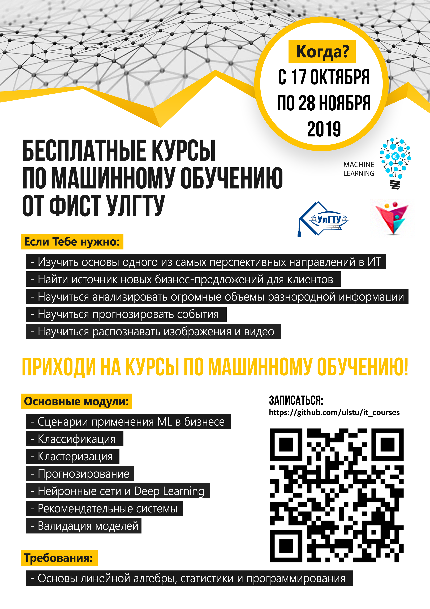
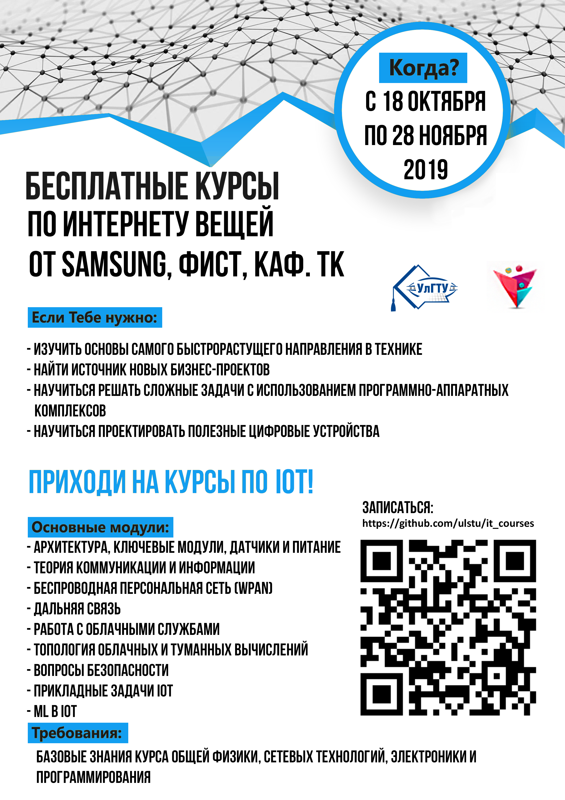
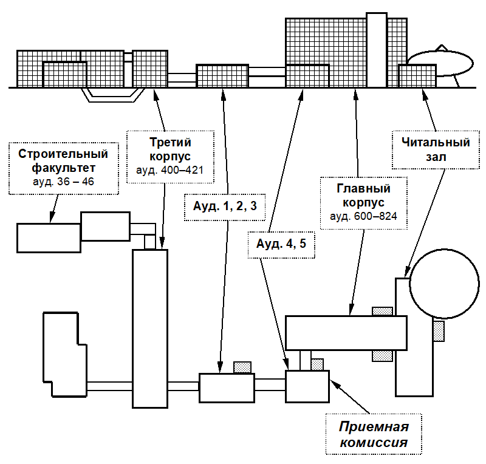

# Открытые курсы от ФИСТ УлГТУ
Осень, 2019

[Регистрация на курсы](https://docs.google.com/forms/d/e/1FAIpQLScwbDPbOm7N9gOb3xTn6PItltEjIhRLgcvaYi13SUCjvx4VZA/viewform)

# Продуктовый менеджмент

Для просмотра страницы с мобильных устройств нажмите на ссылку "View all of Readme.md"

Курс "Продуктовый менеджмент", проводимый совместно с компаний X-Cart. В России остро стоит проблема с тем, что у нас достаточно много технических проектов, но только малая часть из них вырастает в зрелый бизнес. Курс от ведущих экспертов в области продуктового менеджмента позволит студентам научиться создавать продуктовый бизнес, от поиска идеи до построения команды и управления продуктом.

[Чат курса](https://t.me/ulstu_xcart_pm_course)

[Календарь курса](https://calendar.google.com/calendar/embed?src=976r20g9vafutsgo9c2ci1ek1s%40group.calendar.google.com&ctz=Europe%2FSamara)
[iCal](https://calendar.google.com/calendar/ical/976r20g9vafutsgo9c2ci1ek1s%40group.calendar.google.com/public/basic.ics)

[Тематический план и расписание](https://docs.google.com/spreadsheets/d/1VcmiWET40gAgXjFU-nJeGm6O7RL_WGdOm9hRNXcLS94/edit#gid=0)

Часть спикеров будут проводить лекции удаленно с полноценной возможностью построения диалога в формате вопросов и ответов.

# Машинное обучение

Курс "Машинное обучение". Студенты и все слушатели изучат математические основы и практические инструменты одного из самых перспективных направлений в области цифровой экономики, т.к. именно машинное обучение сейчас позволяет решать сложные проблемы в области анализа накопленных данных, которые ранее невозможно было решить имеющимися средствами и алгоритмами.

[Чат курса](https://t.me/ulstu_ml_course)

[Календарь курса](https://calendar.google.com/calendar/embed?src=b2buqaktrkpegambgsrffh4188%40group.calendar.google.com&ctz=Europe%2FSamara)
[iCal](https://calendar.google.com/calendar/ical/b2buqaktrkpegambgsrffh4188%40group.calendar.google.com/public/basic.ics)

[Материалы курса](https://github.com/ulstu/robotics_ml)

# Интернет вещей

Курс "Интернет вещей (IoT)", проводимый совместно с кафедрой "Телекоммуникации" радиотехнического факультета. По мнению аналитического агентства PWC, IoT - самое перспективное направление развития технологий "Индустрии 4.0", т.к. позволяет активно собирать, передавать, накапливать данные со всевозможных устройств, а также проводить их интеллектуальный анализ. Сферы производства, медицины, бытового обслуживания, образования активно трансформируются с использованием многочисленных устройств IoT, с этим нужно уметь работать.

[Чат курса](https://t.me/ulstu_iot_course)

[Календарь курса](https://calendar.google.com/calendar/embed?src=89s87gm9iqj9q58vgrbb4uaulc%40group.calendar.google.com&ctz=Europe%2FSamara)
   [iCal](https://calendar.google.com/calendar/ical/89s87gm9iqj9q58vgrbb4uaulc%40group.calendar.google.com/public/basic.ics)

[Материалы курса](https://github.com/ulstu/iot)

[Видео про ИТ-академию Samsung, направление "Интернет вещей"](https://www.youtube.com/watch?v=3pQ7urP7U4I)

# Схема расположения корпусов УлГТУ

